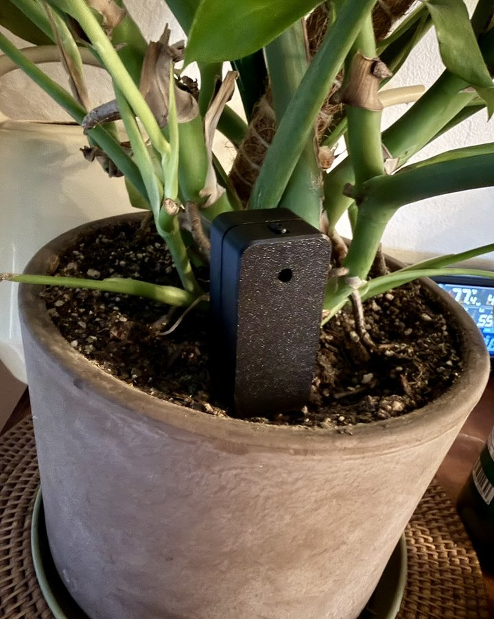
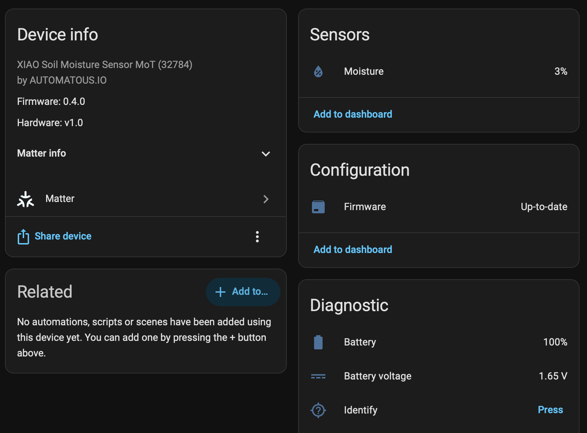

# XIAO Soil Moisture Sensor - Matter over Thread

[](https://opensource.org/licenses/Apache-2.0)
[](../../releases/latest)

[](../../releases)
[](../../stargazers)
[](https://buymeacoffee.com/automatous.io)

<p align="center">
  
  <br>
  <em>Both <a href="docs/POWER.md#field-data">field-test units</a> live in this planter.</em>
</p>

Open source Matter over Thread firmware for the [Seeed Studio XIAO Soil Moisture Sensor](https://www.seeedstudio.com/XIAO-Soil-Sensor-p-6452.html), a capacitive soil sensor built on the XIAO ESP32-C6 that sells for about $12. The stock firmware is [ESPHome over WiFi](https://github.com/Seeed-Studio/xiao-esphome-projects). This firmware reconfigures the C6's 802.15.4 radio to run Thread instead, and the sensor speaks directly to your Matter ecosystem (_if supported_).

The Soil Sensor device type was added in Matter 1.5 and controllers are only now gaining support for it. Very few Matter over Thread soil sensors exist, commercial or DIY, and this firmware is an attempt to be a useful one.

> ✅ **Reversible**: Flashing is a two-way door. The XIAO has native USB-C with a built-in bootloader, no UART wiring or disassembly is needed, and Seeed publishes the stock ESPHome firmware with a [browser flasher](https://gadgets.seeed.cc/). Returning to stock takes a few minutes.

> ⚠️ **Disclaimer**: This firmware uses Matter test credentials (vendor ID `0xFFF1`, product ID `0x8010`) and is not CSA-certified. Ecosystems will warn about an uncertified device during commissioning. That warning is expected. You assume all responsibility for any damage, data loss, or device failure.

## Contents

- [Status](#status)
- [Quick start](#quick-start)
- [Features](#features)
- [Button & LEDs](#button--leds)
- [Compatibility](#compatibility)
- [Documentation](#documentation)
- [Repository layout](#repository-layout)
- [Why?](#why)
- [About](#about)
- [Other projects from Automatous](#other-projects-from-automatous)
- [Related projects](#related-projects)
- [License](#license)

## Status

Current release: v0.4.0 (beta).

| | |
|---|---|
| ✅ Works | Thread commissioning over BLE, soil moisture reporting to Home Assistant, cell voltage, battery percentage and charge level with a replace-battery flag, battery health via internal-resistance (sag) measurement, button-triggered calibration persisted to NVS, Identify from a controller, sleepy end device (LIT ICD) operation with light sleep, multi-fabric, brownout diagnostics, Matter OTA over Thread |
| 🔬 Collecting data | Real-world battery life (see [POWER.md](docs/POWER.md)), calibration defaults across soil types, border router and ecosystem coverage |
| ⚠️ Known limits | AA battery life is on pace for weeks per cell, not months. The first cell dropped about 30 points on the battery gauge in its first week, though that gauge is linear in voltage rather than in capacity and overstates the early decline ([POWER.md](docs/POWER.md#battery-telemetry-and-health)). The radio is no longer the obvious bottleneck, and the investigation into what is going on happens in [POWER.md](docs/POWER.md). USB-powered operation is solid. |

<p align="center">
  
</p>

Battery life is an open experiment run in public. Two units are in the field, their data lives in [POWER.md](docs/POWER.md#field-data), and if you flash a unit of your own, an [issue with your battery data](../../issues/new) adds a row. Contributions of any kind are welcome: [CONTRIBUTING.md](docs/CONTRIBUTING.md).

## Quick start

1. Download the latest firmware from [Releases](../../releases/latest), or [build it yourself](docs/BUILDING.md).
2. Flash over USB-C. No UART or soldering is needed. See [FLASHING.md](docs/FLASHING.md).
3. Commission into your ecosystem with the QR code printed on the serial console. See [COMMISSIONING.md](docs/COMMISSIONING.md).

Later updates can go over the air via [Matter OTA](docs/UPDATING.md), or over the same USB cable.

## Features

- Matter over Thread: native, local, no cloud, no WiFi, no ESPHome dependency
- Soil Sensor device type (0x0045) with the Matter 1.5 SoilMeasurement cluster, not a humidity-sensor workaround
- Sleepy end device: Thread MTD running as a LIT intermittently connected device, light sleep between samples
- Cell voltage in millivolts, battery percentage, charge level (Ok / Warning / Critical), and a `BatReplacementNeeded` flag driven by cell health rather than voltage alone
- Battery health via sag measurement: the firmware briefly loads the cell with its own LEDs about once a day and reads voltage sag as an internal-resistance proxy that flags worn cells before they die
- On-device calibration: triple-press the button and follow the LED prompts with dry air and a glass of water; calibration persists across reboots and reflashes
- Identify from the controller: the status LED blinks yellow so you can tell which sensor you are looking at when several are paired
- Local sampling with delta reporting: the probe is sampled every 15 minutes (configurable) and the radio is only used when the reading changes
- TX power capped at +10 dBm instead of the driver's +20 dBm default, cutting peak battery draw roughly 3x
- Brownout diagnostics: brownout resets blink red at boot and increment a lifetime counter in NVS
- Matter OTA requestor with A/B app partitions: updates arrive over Thread with no cable and keep commissioning, verified from v0.2.0 to v0.3.0 (see [UPDATING.md](docs/UPDATING.md))
- Multi-fabric: pair with more than one Matter controller at the same time

## Button & LEDs

The full reference is in [TROUBLESHOOTING.md](docs/TROUBLESHOOTING.md#led-reference).

| Action | Result |
|---|---|
| Single press | Sample now; LED shows moisture class (red dry, yellow almost dry, green normal) |
| Any press | Wakes the sleepy device; controllers can reach it immediately |
| Triple press | Start [calibration](docs/CALIBRATION.md) (LED-guided, about 30 s) |
| Hold 10 s | Factory reset (red blinks 10 times) |

| LED pattern | Meaning |
|---|---|
| Yellow slow blink | Commissioning window open |
| Yellow medium blink | Identify; a controller asked the device to point itself out |
| Green, 3 blinks | Commissioning complete |
| Red, 5 blinks at boot | Brownout reset detected; check the power source |

## Compatibility

Commissioning needs a Thread border router and a Matter controller that understands the Matter 1.5 Soil Sensor device type. Tested so far:

| Component | Status |
|---|---|
| Home Assistant 2026.7 or newer (Matter server with Matter 1.5 soil sensor support) | ✅ Tested |
| Apple HomePod mini as border router | ✅ Tested |
| Apple Home app | ⏳ No Soil Sensor device type support in the ecosystem yet |
| Google Home app | ⏳ No Soil Sensor device type support in the ecosystem yet |

As of August 2026, Home Assistant is the only major ecosystem that understands the Soil Sensor device type. Apple and Google devices work fine as Thread border routers, but their apps do not show soil moisture yet; a controller that predates the device type will commission the sensor and display nothing. Reports welcome when those ecosystems catch up.

## Documentation

- [Flashing Guide](docs/FLASHING.md) — flashing over USB-C and back to stock
- [Commissioning Guide](docs/COMMISSIONING.md) — pairing with Home Assistant and other ecosystems
- [Calibration Guide](docs/CALIBRATION.md) — LED-guided dry and wet calibration
- [Updating Guide](docs/UPDATING.md) — Matter OTA and USB updates that keep commissioning
- [Power & Battery](docs/POWER.md) — power design decisions and field data
- [Hardware Notes](docs/HARDWARE.md) — pin map, probe drive, battery sensing, antenna
- [Building from Source](docs/BUILDING.md) — dev container, ESP-IDF, release artifacts
- [Troubleshooting](docs/TROUBLESHOOTING.md) — LED reference and common issues
- [Roadmap](docs/ROADMAP.md) — known limitations and planned work
- [Contributing](docs/CONTRIBUTING.md) — commit, branch, and release conventions
- [Changelog](CHANGELOG.md) — release history by version

## Repository layout

```
├── source/              # Self-contained ESP-IDF project
│   ├── main/            # Firmware: soil probe, battery health, button, LEDs, Matter data model
│   ├── partitions.csv   # A/B OTA layout, 4 MB flash
│   └── sdkconfig.defaults
├── scripts/             # Release asset builders (.bin and .ota)
├── docs/                # Guides and images
├── .github/             # Release workflow
└── .devcontainer/       # Pinned build environment (ESP-IDF v5.5.5)
```

## Why?

The stock firmware works, but WiFi is a poor fit for a AA-powered sensor, and it ties the device to your WiFi network and an ESPHome workflow. The ESP32-C6 already carries an 802.15.4 radio, and Thread is designed for exactly this class of device: a battery-powered sensor that sleeps most of the time, wakes briefly, and reports one number to a low-power mesh. Matter on top of Thread makes the sensor a native device in any ecosystem, with no YAML, no bridge, and no cloud account.

Whether Thread delivers the battery life this hardware should be capable of is an open question, and [POWER.md](docs/POWER.md) is where it gets answered in public.

## About

This project comes from the same hands as the [Shelly Gen4 Matter over Thread firmware](https://github.com/automatous-io/shelly-1-gen4-matter-thread), built because a $12 sensor with a Thread-capable radio deserved better than WiFi on a AA cell. If this firmware is useful to you, a ⭐ helps other people find it, and a [coffee](https://buymeacoffee.com/automatous.io) helps keep it developed.

## Other projects from Automatous

| Project | What it is |
|---|---|
| [Shelly Gen4 Matter over Thread](https://github.com/automatous-io/shelly-1-gen4-matter-thread) | The first third-party open source Matter over Thread firmware for Shelly Gen4 devices |
| [Shelly Gen4 ESPHome](https://github.com/automatous-io/shelly-gen4-esphome) | ESPHome for Shelly Gen4 devices |
| [T1N Smart Lock](https://github.com/automatous-io/t1n-smart-lock) | Open source Matter over Thread smart lock for the factory central locking on a 2005 Dodge Sprinter 2500 |

## Related projects

| Project | What it is |
|---|---|
| [xiao-esphome-projects](https://github.com/Seeed-Studio/xiao-esphome-projects) | Seeed's stock ESPHome firmware for this sensor, restorable any time via the [browser flasher](https://gadgets.seeed.cc/) |
| [XIAO Soil Moisture Sensor wiki](https://wiki.seeedstudio.com/xiao_soil_moisture_sensor/) | Seeed's official documentation for the hardware |

## License

[Apache 2.0](LICENSE). Portions derived from [Espressif esp-matter](https://github.com/espressif/esp-matter) examples (Apache 2.0). Probe excitation parameters and the battery voltage mapping match the [stock ESPHome firmware](https://github.com/Seeed-Studio/xiao-esphome-projects) to keep readings comparable.
