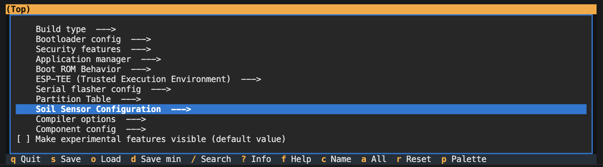
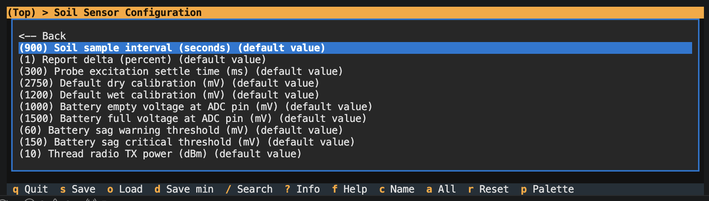

**[README](../README.md)** > **Building from Source** · [Report an issue](../../../issues/new)

# Building from Source

## Dev container

The repo ships a [dev container](../.devcontainer/) pinned to ESP-IDF v5.5.5, the exact environment releases are built with. Open the repo folder in VS Code with the Dev Containers extension (or any devcontainer-compatible tool), accept "Reopen in Container," and build from the container terminal:

```sh
cd source
idf.py build
```

The first build downloads the managed components per [dependencies.lock](../source/dependencies.lock). Everyone resolves identical versions.

## Flashing what you built

The container cannot see USB on macOS or Windows super easily without going through a few hoops. The normal workflow is to build inside and flash from the host. The build output sits in the bind-mounted workspace, visible to both:

```sh
# in the container
python3 ../scripts/make-release-bin.py

# on the host, sensor on USB-C
esptool.py --chip esp32c6 write_flash 0x0 source/automatous-io-xiao-soil-moisture-sensor-vX.Y.Z.bin
```

For logs, open any serial terminal on the host at 115200 baud.

On Linux with Docker Engine, the container can flash directly. Append your serial device to `runArgs` in [devcontainer.json](../.devcontainer/devcontainer.json) (the exact line is in a comment there), rebuild the container, and `idf.py flash monitor` works inside.

## Manual toolchain

Without the container, install [ESP-IDF v5.5.5](https://docs.espressif.com/projects/esp-idf/en/v5.5.5/esp32c6/get-started/index.html), export its environment, and run the same `idf.py build` from `source/`. The target (`esp32c6`) and all project settings come from [sdkconfig.defaults](../source/sdkconfig.defaults). Other IDF versions may work but are unsupported; the combination of Matter, OpenThread, and power management is sensitive to toolchain drift.

## What's in the build

esp_matter comes from the component registry as a managed component (`^1.6.0`); no esp-matter clone or submodules are needed. The 1.6.0 component ships the Soil Sensor endpoint helper and the `SetSoilMoisture` glue natively, so the project uses them directly. Earlier releases carried a `soil_measurement_compat` shim that mirrored those pieces while the 1.5.1 component lacked them; it was deleted in v0.3.0.

The device identity uses test credentials. The example DAC provider only embeds keys for PIDs `0x8000` through `0x801F`, and this project uses `0x8010`. A PID outside that range needs a factory partition from esp-matter's `mfg_tool`.

## Build-time configuration

Sample interval, report delta, calibration defaults, battery thresholds, and Thread TX power are all under `idf.py menuconfig` in the Soil Sensor Configuration menu. The options are documented inline in [Kconfig.projbuild](../source/main/Kconfig.projbuild) and discussed in [POWER.md](POWER.md#tuning).

<p align="center">
  
  <br>
  
</p>

## Release builds

A release consists of the merged flash image, flashable at `0x0`, plus the `.ota` image for Matter OTA:

```sh
idf.py build
python3 ../scripts/make-release-bin.py   # -> automatous-io-xiao-soil-moisture-sensor-vX.Y.Z.bin
python3 ../scripts/make-matter-ota.py    # -> automatous-io-xiao-soil-moisture-sensor-vX.Y.Z.ota
```

Both scripts read their identity from the build rather than taking arguments: vendor and product ID from the built sdkconfig, the software version from `CHIPProjectConfig.h`. They verify the version agrees with `PROJECT_VER` / `PROJECT_VER_NUMBER` in CMakeLists.txt and is actually compiled into the built binary, and refuse a stale build rather than packaging it under the wrong version. The `.bin` is the merged flash image assembled from the build's `flash_args`; the `.ota` wraps the app image using the SDK's `ota_image_tool.py` from inside the esp_matter managed component.

Naming and the release process are in [CONTRIBUTING.md](CONTRIBUTING.md#releases).

## Related documentation

- [README](../README.md) — project overview and quick start
- [Flashing Guide](FLASHING.md) — flashing over USB-C and back to stock
- [Commissioning Guide](COMMISSIONING.md) — pairing with Home Assistant and other ecosystems
- [Calibration Guide](CALIBRATION.md) — LED-guided dry and wet calibration
- [Updating Guide](UPDATING.md) — Matter OTA and USB updates that keep commissioning
- [Power & Battery](POWER.md) — power design decisions and field data
- [Hardware Notes](HARDWARE.md) — pin map, probe drive, battery sensing, antenna
- [Troubleshooting](TROUBLESHOOTING.md) — LED reference and common issues
- [Roadmap](ROADMAP.md) — known limitations and planned work
- [Contributing](CONTRIBUTING.md) — commit, branch, and release conventions
- [Changelog](../CHANGELOG.md) — release history by version
