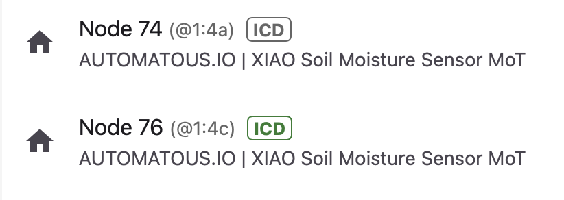
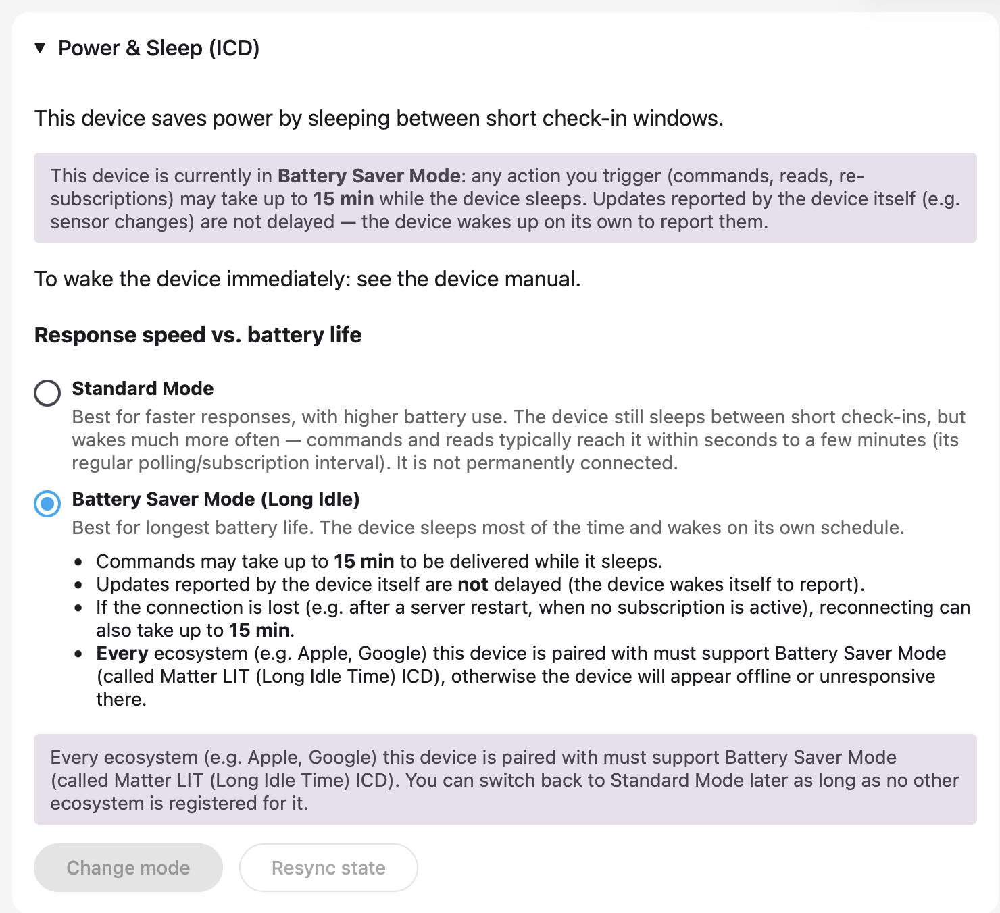

**[README](../README.md)** > **Commissioning Guide** · [Report an issue](../../../issues/new)

# Commissioning Guide

## Requirements

Commissioning needs three things. The first is a Thread border router on your network, such as Home Assistant with a Connect ZBT-1 or SkyConnect running OTBR, a HomePod (2nd gen or mini), an Apple TV 4K, or a Nest Hub (2nd gen). The second is a Matter controller that knows the Soil Sensor device type from Matter 1.5. Home Assistant supports it as of release 2026.7, whose Matter server brought Matter 1.5.1 compliance; older controllers may commission the device but show no entities. The third is the device's onboarding codes, which print on the serial console at every boot ([FLASHING.md](FLASHING.md#flash-a-release-binary)). This firmware ships the standard Matter test setup parameters; the manual pairing code is `34970112332` with passcode `20202021`, and the console output is authoritative if that ever changes.

> ⚠️ **Test credentials**: This device uses VID `0xFFF1` / PID `0x8010` and is not CSA-certified. Every ecosystem will warn you about an uncertified device, and Home Assistant's Matter Server needs Test Net DCL enabled before it will commission one at all. Both are part of the flow.

## Home Assistant

1. Make sure the Matter Server add-on or integration is installed and your border router is up.
2. Enable Test Net DCL, without which the server refuses test-credentialed devices: go to Settings, then Apps, then Matter Server, then Configuration, turn on **Enable test-net DCL usage**, and restart the add-on. The same setting later serves [OTA updates](UPDATING.md#matter-ota).
3. Go to Settings, then Devices & Services, then Add Integration, then Matter, and scan the QR code from the serial console or enter the manual pairing code.
4. Accept the uncertified-device prompt.
5. The device commissions over BLE, joins your Thread network, and appears with soil moisture, battery, and battery-level entities. Press the button once when it lands, since the entities can otherwise take up to 15 minutes to show up.

<p align="center">
  
</p>

While the commissioning window is open the yellow LED blinks slowly. Success is three green blinks, and the first soil reading reports right after commissioning completes.

A newly paired sensor can still appear in Home Assistant as a device with no entities at all. Home Assistant creates an entity only once it has read a value for the attribute behind it, and this firmware goes back to sleep after commissioning and checks in every 15 minutes. If that read misses a check-in, the device page stays empty until the next one. Press the button once and the entities populate immediately, because a press forces a sample and brings the radio up. An empty device page right after pairing is this timing, not a failed commission.

## Apple Home and Google Home

As of August 2026, neither ecosystem understands the Soil Sensor device type yet; Home Assistant is the only major controller that does. Apple and Google devices work fine as Thread border routers for the sensor, and the firmware is multi-fabric, but pairing their apps directly will show no soil entity until they add support for the device type. If you try it after they catch up, [report the result](../../../issues) and the compatibility table can record it as tested.

To share from Home Assistant to another ecosystem, use the Share device flow on the Matter device page. The sensor supports multiple fabrics simultaneously.

## A note on sleepy devices

This is a Thread sleepy end device. It wakes to poll every 20 seconds in normal operation, and controller actions can take a few seconds. That is Thread working as designed, not the sensor misbehaving. Pressing the button once wakes it and makes it immediately reachable, which helps during commissioning and troubleshooting. Expect availability indicators in Home Assistant to update on the sampling cadence, not continuously.

Home Assistant surfaces the sleep configuration as a Power & Sleep panel on the device's Matter page, with two modes. Standard Mode polls more often: controller actions reach the device within seconds at the cost of higher battery use, a fine trade on USB power. Battery Saver Mode (Long Idle) is the firmware's LIT configuration: commands may take up to 15 minutes to reach a sleeping device, and it is the right choice on AA. Readings the device reports on its own are never delayed in either mode; the choice only affects how long controller-initiated actions can wait. Both modes are running in the field here, Standard on the USB-powered unit and Battery Saver on the AA unit, and switching between them from the panel works.

<p align="center">
  
</p>

## A status label like the LEDs

The firmware reports moisture as a percentage. To get a text label in Home Assistant that matches the device's LED classification, add a template sensor helper (Settings, then Devices & Services, then Helpers, then Create helper, then Template sensor) with this state template, adjusting the entity id to your device:

```jinja

unknown
Dry
Almost Dry
Normal Moisture

```

The thresholds mirror the firmware's single-press LED verdict ([CALIBRATION.md](CALIBRATION.md#sanity-checking)). The device pages in this documentation show the result as a "Soil Status" sensor.

## Decommissioning and re-pairing

When the last fabric is removed by a controller, the device automatically reopens a 5-minute commissioning window, shown by the yellow blink, and can be re-paired without touching it. A factory reset is a 10-second button hold: the red LED blinks ten times, all fabrics and Thread credentials are wiped, and the device returns to out-of-box BLE commissioning.

## Related documentation

- [README](../README.md) — project overview and quick start
- [Flashing Guide](FLASHING.md) — flashing over USB-C and back to stock
- [Calibration Guide](CALIBRATION.md) — LED-guided dry and wet calibration
- [Updating Guide](UPDATING.md) — Matter OTA and USB updates that keep commissioning
- [Power & Battery](POWER.md) — power design decisions and field data
- [Hardware Notes](HARDWARE.md) — pin map, probe drive, battery sensing, antenna
- [Building from Source](BUILDING.md) — dev container, ESP-IDF, release artifacts
- [Troubleshooting](TROUBLESHOOTING.md) — LED reference and common issues
- [Roadmap](ROADMAP.md) — known limitations and planned work
- [Contributing](CONTRIBUTING.md) — commit, branch, and release conventions
- [Changelog](../CHANGELOG.md) — release history by version
