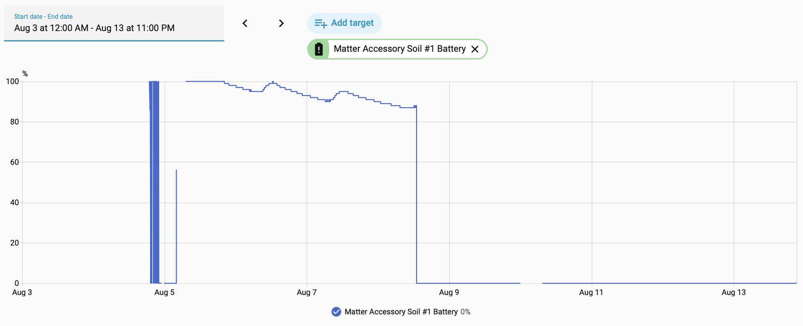

**[README](../README.md)** > **Hardware Notes** · [Report an issue](../../../issues/new)

# Hardware Notes

The [Seeed Studio XIAO Soil Moisture Sensor](https://www.seeedstudio.com/XIAO-Soil-Sensor-p-6452.html) ([wiki](https://wiki.seeedstudio.com/xiao_soil_moisture_sensor/)) is a XIAO ESP32-C6 carrier with a capacitive soil probe, three status LEDs, a user button, a AA battery holder with a boost converter, and an external U.FL antenna, all in a garden-tolerant enclosure. This page records what the firmware knows about the board.

## Pin map

From [app_priv.h](../source/main/app_priv.h):

| GPIO | XIAO pin | Function |
|---|---|---|
| 0 | D0 | Battery voltage ADC (through on-board divider) |
| 1 | D1 | Soil probe output ADC |
| 2 | D2 | User button (active low) |
| 3 | - | RF switch enable (driven low to enable) |
| 14 | - | Antenna select (driven high for the external U.FL) |
| 18 | D10 | Yellow LED |
| 19 | D8 | Green LED |
| 20 | D9 | Red LED |
| 21 | D3 | Soil probe excitation, 200 kHz PWM |

## Soil probe

The capacitive probe is driven by a 200 kHz excitation signal at 68% duty, the same parameters the [stock ESPHome firmware](https://github.com/Seeed-Studio/xiao-esphome-projects) uses, and readings stay comparable between the two. A measurement turns the PWM on, waits 300 ms for the probe's RC filter to settle, averages 10 ADC reads over about half a second, and turns the PWM off. Higher moisture produces lower voltage, and the dry and wet calibration points ([CALIBRATION.md](CALIBRATION.md)) map millivolts to a 0-100% scale.

The ADC runs at 12 dB attenuation with ESP-IDF curve-fitting calibration, which makes millivolt values meaningful across units.

## Battery sensing

The AA cell voltage arrives at GPIO0 through a divider, where 1000 mV at the pin maps to 0% and 1500 mV to 100%, matching the stock firmware. Beyond resting voltage, the firmware measures sag under load by lighting all three LEDs for about 150 ms as a known load and comparing the loaded and resting readings. The sag is an internal-resistance proxy for cell health; thresholds and details are in [POWER.md](POWER.md#battery-telemetry-and-health).

On USB power the cell is out of the load path and the battery percentage is not meaningful; it typically pins at 0%. The history below is from a unit that ran its first three days on AA and then moved to USB power, where the reading flatlines at zero while the device keeps reporting soil data normally.

  

## Antenna

The C6's RF output routes through a switch to an external U.FL antenna, which is Seeed's design for this kit. The firmware enables the switch and selects the external antenna at boot, and holds the selection through light sleep. A disconnected U.FL pigtail causes very poor range. Check it first when debugging weak Thread connectivity.

## Power path

A single AA cell feeds a boost converter that supplies the 3.3 V rail. This is the component under investigation for the short AA runtime; see [the AA problem](POWER.md#the-aa-problem). The XIAO module also exposes LiPo battery pads, which may be a better-behaved power path, but that has not been tested with the kit's enclosure.

## Brownout behavior

When the supply sags below the ESP32-C6's brownout threshold mid-operation, typically a worn cell meeting a TX peak, the chip resets. The firmware makes this visible with five red blinks at boot after a brownout and a lifetime counter in NVS that prints on the serial console at every boot. A climbing brownout counter means the power source is dying or undersized.

## Related documentation

- [README](../README.md) — project overview and quick start
- [Flashing Guide](FLASHING.md) — flashing over USB-C and back to stock
- [Commissioning Guide](COMMISSIONING.md) — pairing with Home Assistant and other ecosystems
- [Calibration Guide](CALIBRATION.md) — LED-guided dry and wet calibration
- [Updating Guide](UPDATING.md) — Matter OTA and USB updates that keep commissioning
- [Power & Battery](POWER.md) — power design decisions and field data
- [Building from Source](BUILDING.md) — dev container, ESP-IDF, release artifacts
- [Troubleshooting](TROUBLESHOOTING.md) — LED reference and common issues
- [Roadmap](ROADMAP.md) — known limitations and planned work
- [Contributing](CONTRIBUTING.md) — commit, branch, and release conventions
- [Changelog](../CHANGELOG.md) — release history by version
