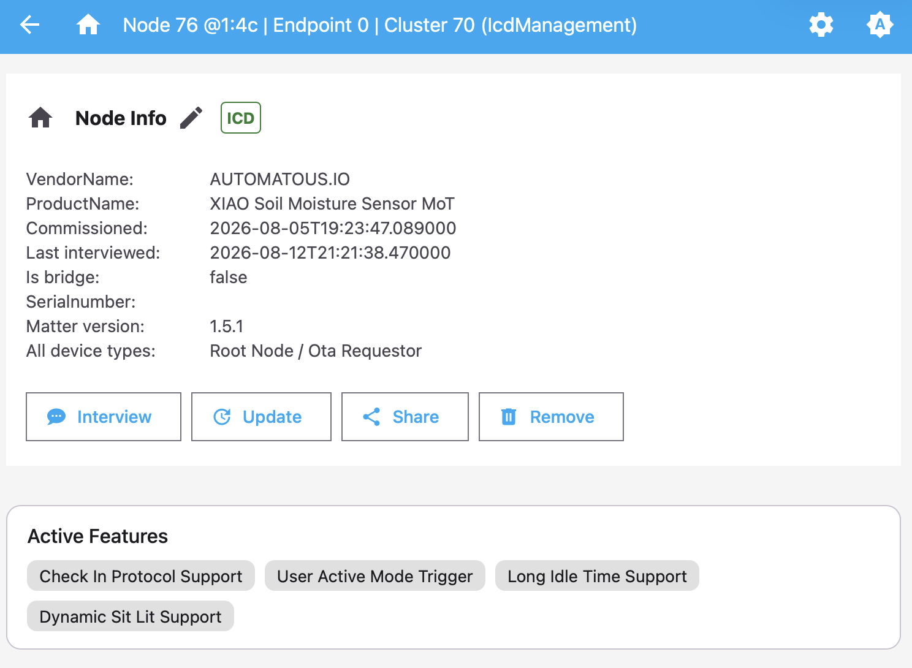
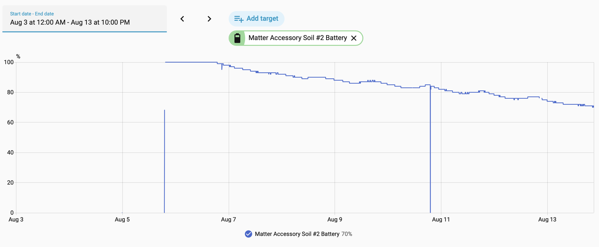

**[README](../README.md)** > **Power & Battery** · [Report an issue](../../../issues/new)

# Power & Battery

Battery life is the point of running Matter over Thread on this hardware. This page records every power decision the firmware makes, the field data collected so far, and how to contribute your own.

## Contents

- [What the firmware does to save power](#what-the-firmware-does-to-save-power)
- [Battery telemetry and health](#battery-telemetry-and-health)
- [Field data](#field-data)
- [The AA problem](#the-aa-problem)
- [Tuning](#tuning)
- [File a field report](#file-a-field-report)

## What the firmware does to save power

| Decision | Detail | Where |
|---|---|---|
| Thread sleepy end device | MTD (never a router), light sleep between duties, 802.15.4 radio sleep enabled | [sdkconfig.defaults](../source/sdkconfig.defaults) |
| LIT ICD | Idle mode 900 s, active mode 1 s, active threshold 5 s (spec minimum); slow poll 20 s, fast poll 500 ms. Runs as a short-idle-time device until an ICD client registers | [sdkconfig.defaults](../source/sdkconfig.defaults) |
| TX power capped at +10 dBm | The 802.15.4 driver defaults to +20 dBm with ~350 mA TX peaks; +10 dBm cuts peak draw roughly 3x with range to spare for a home mesh | `thread_txpower_set()` in [app_main.cpp](../source/main/app_main.cpp) |
| Local sampling, delta reporting | The probe is sampled every 15 min with the radio untouched; a Matter report is only generated when moisture changes by 1% or more | [Kconfig](../source/main/Kconfig.projbuild) |
| Probe powered only while measuring | The 200 kHz excitation PWM runs for ~800 ms per sample (300 ms settle plus 10 averaged reads), otherwise off | [soil_probe.cpp](../source/main/soil_probe.cpp) |
| Light sleep and tickless idle | Flash powered down in sleep; BLE used for commissioning only, then sleeps; WiFi compiled out entirely; IPv4 compiled out (Thread is IPv6-only) | [sdkconfig.defaults](../source/sdkconfig.defaults) |
| Button wake | A press fires the LIT ICD User Active Mode Trigger, making the device reachable on demand instead of polling fast all the time | [button.cpp](../source/main/button.cpp) |

USB power holds off light sleep to keep the USB-Serial/JTAG console alive, which means a USB-powered unit draws more average current than a battery-powered one. Keep that in mind when comparing the field data rows below.

The LIT configuration is visible from the controller side. The Matter server's node page lists the ICD feature set the firmware announces, and Home Assistant surfaces the same configuration as a Power & Sleep panel with a Battery Saver Mode toggle ([COMMISSIONING.md](COMMISSIONING.md#a-note-on-sleepy-devices)).

  

## Battery telemetry and health

The firmware exposes three values over Matter, through the Power Source cluster on the root endpoint, and they appear as entities in Home Assistant. Battery percentage is a linear map of the resting cell voltage through the on-board divider, where 1.0 V at the ADC pin reads 0% and 1.5 V reads 100%, matching the stock firmware's mapping. Charge level reports Ok, Warning at 20% or a worn cell, and Critical at 10% or a dying cell. `BatReplacementNeeded` is driven by cell health rather than voltage alone.

The health measurement works like this: roughly once a day the firmware measures the cell voltage, turns on all three LEDs as a known load for about 150 ms, and measures again. The sag between the two readings is a proxy for internal resistance. A fresh alkaline sags under about 20 mV and a worn one far more. Sag of 60 mV or more reports Warning and sets the replace flag, and 150 mV or more reports Critical. A tired cell gets flagged weeks before it goes flat.

Every brownout reset, the failure mode of a worn AA supplying a radio transmit peak, blinks red five times at boot and increments a lifetime counter in NVS. The counter prints on the serial console at every boot and can be checked months later.

Raw voltages (rest, loaded, and sag in mV) print to the serial console at each sample. Only the derived values go over Matter.

## Field data

This table is the reason the page exists. [Add your row](#file-a-field-report).

| # | Power source | Firmware | Interval / TX | Started | Result so far |
|---|---|---|---|---|---|
| 1 | AA for the first three days, then USB-C from a 50,000 mAh power bank; ICD Standard Mode | v0.2.0 | 900 s / +10 dBm | Aug 5, 2026 | On AA it went from 100% to 87% in three days, the same pace as unit #2's cell, and was deliberately moved to the power bank. Since Aug 8 the bank's indicator has dropped from 29% to 26% over several days, which extrapolates to months per charge even though USB power disables light sleep and Standard Mode polls faster. Reports reliably from a good distance to the border router |
| 2 | 1x AA alkaline, LIT Battery Saver Mode | v0.2.0 | 900 s / +10 dBm | Aug 5, 2026 | 100% on Aug 6 down to 70% on Aug 13, about 30 percentage points in the first week, and still running. The pace points to weeks per cell rather than months. Investigation below |

  

Unit #2's first week on one AA cell, as reported by the firmware's own battery telemetry. The two vertical drops to zero are battery pulls during testing, not the cell. Two units under one roof is not a dataset, which is why the [field report](#file-a-field-report) exists.

## The AA problem

The AA cell feeds a TI TPS61021A boost converter that generates 3.3 V for the whole board ([power path](HARDWARE.md#power-path)). Two observations point at the power path rather than the radio. The same hardware drains far faster than it should on both the stock WiFi firmware and this Thread firmware, despite radically different radio duty cycles. And the USB-powered unit, which never light-sleeps at all, still draws little enough to sit at one power-bank percent for days.

The open questions, in rough order of usefulness:

1. Board quiescent draw. What does the board pull from the cell with the radio asleep? The TPS61021A datasheet puts its quiescent current around 17 µA, which on its own would run an AA for years. A bench reading far above that points at light-load conversion efficiency or another leak on the board rather than the converter's idle draw. Answering this needs a meter in series with the AA; even a cheap multimeter with a µA range helps.
2. Brownout resets. A worn AA, a boost converter, and a TX peak can form a reset loop that burns the cell. The lifetime brownout counter, printed on the serial console at boot, shows whether this is happening. A dead-in-days unit with dozens of brownouts would settle the question.
3. Sag trajectory. Whether the daily sag measurement climbs steadily (a cell wearing out) or jumps (a cell being hammered) is visible in the serial logs.
4. Lithium AA cells. Energizer Ultimate Lithium holds voltage far better under pulse loads than alkaline. Whether it changes the outcome is untested.

If the power-path theory is right, the fix may be hardware, such as a different cell chemistry or a LiPo on the XIAO's battery pads bypassing the boost path, rather than firmware. That is worth knowing before anyone chases software micro-optimizations.

## Tuning

These are build-time options under `idf.py menuconfig`, in the Soil Sensor Configuration menu ([Kconfig.projbuild](../source/main/Kconfig.projbuild)):

| Option | Default | Effect |
|---|---|---|
| `SOIL_SAMPLE_INTERVAL_SECONDS` | 900 | Wake cadence. Soil moisture moves slowly; 1800 or 3600 s is a legitimate choice |
| `SOIL_REPORT_DELTA_PERCENT` | 1 | Minimum change before the radio reports. Raise to 2-3% to cut reports further |
| `SOIL_THREAD_TX_POWER_DBM` | +10 | Try lower if the sensor is near your border router; every 3 dB roughly halves TX peak power |
| `SOIL_BATTERY_SAG_WARN_MV` / `_CRIT_MV` | 60 / 150 | Health thresholds, if your cell chemistry sags differently |

If you run a non-default configuration, say so in your field report. Those runs are the experiments this page needs.

## File a field report

Open an [issue](../../../issues/new) with your power source and cell type, the firmware version, any non-default tuning, the start date, and the outcome so far. A screenshot of the Home Assistant battery-percentage history graph carries most of the story. If you have serial access, include the lifetime brownout count and a recent sag reading from the logs.

Negative results are as valuable as positive ones. A report that reads "died in 4 days on alkaline, 37 brownouts" is exactly the kind of row the field data table needs.

## Related documentation

- [README](../README.md) — project overview and quick start
- [Flashing Guide](FLASHING.md) — flashing over USB-C and back to stock
- [Commissioning Guide](COMMISSIONING.md) — pairing with Home Assistant and other ecosystems
- [Calibration Guide](CALIBRATION.md) — LED-guided dry and wet calibration
- [Updating Guide](UPDATING.md) — Matter OTA and USB updates that keep commissioning
- [Hardware Notes](HARDWARE.md) — pin map, probe drive, battery sensing, antenna
- [Building from Source](BUILDING.md) — dev container, ESP-IDF, release artifacts
- [Troubleshooting](TROUBLESHOOTING.md) — LED reference and common issues
- [Roadmap](ROADMAP.md) — known limitations and planned work
- [Contributing](CONTRIBUTING.md) — commit, branch, and release conventions
- [Changelog](../CHANGELOG.md) — release history by version
