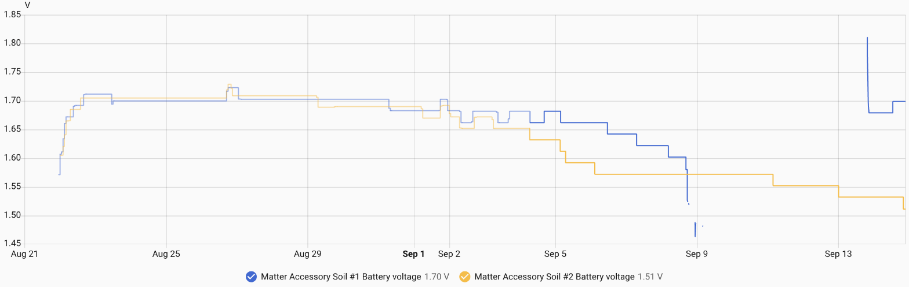
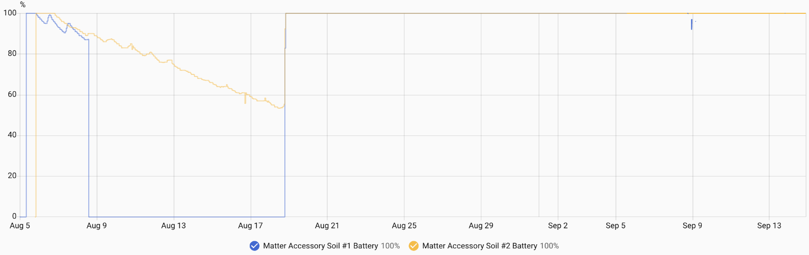
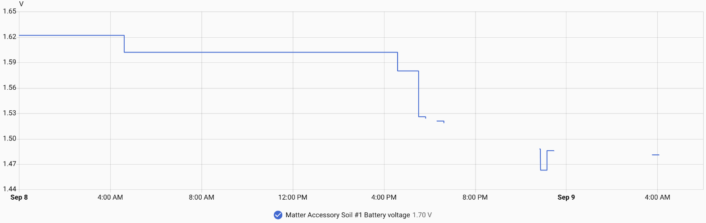

**[README](../README.md)** > **Power & Battery** · [Report an issue](../../../issues/new)

# Power & Battery

Battery life is the point of running Matter over Thread on this hardware. This page records every power decision the firmware makes, the field data collected so far, and how to contribute your own.

## Contents

- [What the firmware does to save power](#what-the-firmware-does-to-save-power)
- [Battery telemetry and health](#battery-telemetry-and-health)
- [Field data](#field-data)
- [The AA problem](#the-aa-problem)
- [Tuning](#tuning)
- [File a field report](#file-a-field-report)

## What the firmware does to save power

| Decision | Detail | Where |
|---|---|---|
| Thread sleepy end device | MTD (never a router), light sleep between duties, 802.15.4 radio sleep enabled | [sdkconfig.defaults](../source/sdkconfig.defaults) |
| LIT ICD | Idle mode 900 s, active mode 1 s, active threshold 5 s (spec minimum); slow poll 20 s, fast poll 500 ms. Runs as a short-idle-time device until an ICD client registers | [sdkconfig.defaults](../source/sdkconfig.defaults) |
| TX power capped at +10 dBm | The 802.15.4 driver defaults to +20 dBm with ~350 mA TX peaks; +10 dBm cuts peak draw roughly 3x with range to spare for a home mesh | `thread_txpower_set()` in [app_main.cpp](../source/main/app_main.cpp) |
| Local sampling, delta reporting | The probe is sampled every 15 min with the radio untouched; a Matter report is only generated when moisture changes by 1% or more | [Kconfig](../source/main/Kconfig.projbuild) |
| Probe powered only while measuring | The 200 kHz excitation PWM runs for ~800 ms per sample (300 ms settle plus 10 averaged reads), otherwise off | [soil_probe.cpp](../source/main/soil_probe.cpp) |
| Light sleep and tickless idle | Flash powered down in sleep; BLE used for commissioning only, then sleeps; WiFi compiled out entirely; IPv4 compiled out (Thread is IPv6-only) | [sdkconfig.defaults](../source/sdkconfig.defaults) |
| Button wake | A press fires the LIT ICD User Active Mode Trigger, making the device reachable on demand instead of polling fast all the time | [button.cpp](../source/main/button.cpp) |

USB power holds off light sleep to keep the USB-Serial/JTAG console alive, which means a USB-powered unit draws more average current than a battery-powered one. Keep that in mind when comparing the field data rows below.

The LIT configuration is visible from the controller side. The Matter server's node page lists the ICD feature set the firmware announces, and Home Assistant surfaces the same configuration as a Power & Sleep panel with a Battery Saver Mode toggle ([COMMISSIONING.md](COMMISSIONING.md#a-note-on-sleepy-devices)).

  

## Battery telemetry and health

The firmware exposes four values over Matter, through the Power Source cluster on the root endpoint, and they appear as entities in Home Assistant. Cell voltage is the resting measurement in millivolts, reported as measured with no mapping applied. Battery percentage is a linear map of that voltage, where 1.0 V at the ADC pin reads 0% and 1.5 V reads 100%, matching the stock firmware's mapping. Charge level reports Ok, Warning at 20% or a worn cell, and Critical at 10% or a dying cell. `BatReplacementNeeded` is driven by cell health rather than voltage alone.

The percentage mapping assumes an alkaline cell and is linear in voltage rather than in capacity, which makes it a rough guide and not a fuel gauge. An alkaline drops quickly from 1.5 V to about 1.35 V while giving up only the first fifth or so of its capacity, then sits on a long plateau where most of the remaining capacity is spent, so the reported percentage falls fast in the first week and then slows. A lithium primary cell is served worse still, because it rests above 1.5 V for most of its life and the percentage therefore pins at 100% until the cell is nearly finished. The [field data](#field-data) bears that out: one lithium cell reported 100% for 21 days and 97% in its final hours. Cell voltage is reported precisely because it does not depend on any of that. `SOIL_BATTERY_EMPTY_MV` and `SOIL_BATTERY_FULL_MV` move the endpoints for a different chemistry, though the mapping stays linear between them.

The health measurement works like this: roughly once a day the firmware measures the cell voltage, turns on all three LEDs as a known load for about 150 ms, and measures again. The sag between the two readings is a proxy for internal resistance. A fresh alkaline sags under about 20 mV and a worn one far more. Sag of 60 mV or more reports Warning and sets the replace flag, and 150 mV or more reports Critical. A tired cell gets flagged weeks before it goes flat.

Every brownout reset, the failure mode of a worn AA supplying a radio transmit peak, blinks red five times at boot and increments a lifetime counter in NVS. The counter prints on the serial console at every boot and can be checked months later.

Rest, loaded, and sag voltages all print to the serial console at each sample. Of those, the resting cell voltage also goes over Matter, while the loaded and sag readings stay on the console. The console is not an option on a running battery unit, because connecting USB disables the boost converter and takes the cell out of the load path ([HARDWARE.md](HARDWARE.md#power-path)), which is the reason the resting voltage is reported over Matter at all.

Home Assistant rounds sensor values to a default display precision, so the voltage entity can read a flat 2 V on a fresh lithium cell. Raising the decimals under the entity's Display precision setting shows the real figure.

## Field data

This table is the reason the page exists. [Add your row](#file-a-field-report). Both units sit under one roof on the same Thread network and border router, which is a comparison, not a dataset.

| # | Mode | Firmware | Interval / TX | Started | Result so far |
|---|---|---|---|---|---|
| 1 | ICD Standard Mode | v0.2.0 at start, v0.4.0 over OTA from Aug 21 | 900 s / +10 dBm | Aug 5, 2026 | Three days on alkaline, ten days on USB-C from a 50,000 mAh power bank, then lithium from Aug 18. That lithium cell died on Sep 8 after 21 days. On a fresh lithium cell since Sep 13 |
| 2 | LIT Battery Saver Mode | v0.2.0 at start, v0.4.0 over USB from Aug 21 | 900 s / +10 dBm | Aug 5, 2026 | Alkaline from Aug 5 to Aug 18, pulled at 53%, then lithium from Aug 18. Still running on that cell at 28 days as of Sep 14, at 1.51 V and a reported 100% |

Each cell is a run of its own, and a field report should use the same shape. The lithium cells are all Energizer Ultimate Lithium, a Li-FeS2 chemistry. Voltages are daily minimums, for the reason given under the graph. Voltage telemetry arrived with v0.4.0 on Aug 21, so the alkaline runs have only the percentage.

| Unit | Cell | Mode | Started | Ended | Days | Voltage, start to end | How it ended |
|---|---|---|---|---|---|---|---|
| 1 | AA alkaline | Standard | Aug 5 | Aug 8 | 3 | 100% to 87% | Pulled, moved to the power bank |
| 1 | USB-C, 50,000 mAh power bank | Standard | Aug 8 | Aug 18 | 10 | Bank indicator 29% to 24% in the first week | Pulled, moved to lithium |
| 1 | Energizer Ultimate Lithium AA | Standard | Aug 18 | Sep 8 | 21 | 1.70 V on the plateau, 1.602 V the last morning | Dead. Details below |
| 1 | Energizer Ultimate Lithium AA | Standard | Sep 13 | | 1 | 1.811 V at insertion, 1.679 V by the next morning | Running |
| 2 | AA alkaline | Battery Saver | Aug 5 | Aug 18 | 13 | 100% to 53.5% | Pulled and replaced with lithium. The decline was linear at 3.77 points per day, extrapolating to about 27 days |
| 2 | Energizer Ultimate Lithium AA | Battery Saver | Aug 18 | | 28 | 1.71 V on the plateau, 1.511 V on Sep 14 | Running, 100% on the gauge throughout |

  

Cell voltage for both lithium cells, from the day voltage telemetry arrived. Unit #1 is the upper line for most of the run and is the one that died. The four-day gap and the spike to 1.81 V are the dead cell and its replacement.

  

The same two units on the percentage gauge, from the first alkaline cell onward. The dips to zero in August are cell pulls during testing. Unit #2's alkaline slid to 53% in 13 days; on lithium both units sat at 100% for the entire run, including the hours unit #1 spent dying.

One caution when reading any of these graphs. Both cells show a daily oscillation in reported voltage, troughing around 6-7 AM and peaking around 3-5 PM, which is ambient temperature rather than charge. Unit #1 alternated between two adjacent report steps, 1.662 V and 1.682 V, so with the 20 mV reporting gate the true daily amplitude sits somewhere between 20 and 40 mV. That is the same order of magnitude as a real discharge trend, which means the instantaneous number hides the trend. Take each day's minimum and the trend separates out, which is why every voltage figure on this page is a daily minimum.

### How the lithium cell died

Unit #1's lithium cell gave about a day of warning, and only in the voltage. Its daily minimum had stepped down 20 mV a day for three days, from 1.662 V on Sep 5 to 1.602 V on the morning of Sep 8, which on an alkaline would be an ordinary slope. That afternoon it read 1.580 V at 16:35 and 1.526 V at 17:31, and it dropped off the network at 17:49. It came back three times for a few minutes each, reporting between 1.463 V and 1.521 V, and was last heard from at 04:04 on Sep 9. Through all of that the percentage read 92% to 97%, because the alkaline mapping treats 1.48 V as a nearly full cell. A Li-FeS2 cell rests on a shallow slope until it is hours from the end and then falls off a cliff, and the gauge reported a nearly full cell while the device was brownout-looping.

  

Unit #1's last day. The gaps are the device off the network.

Unit #2 was expected to go first and did not. On Sep 6 its 1.572 V looked like the start of the knee, because it had lost 98 mV in five days with the steps growing. It then sat at exactly 1.572 V for five days and has stepped down 20 mV every day or two since. Unit #1 died from a higher voltage on a steadier slope. Two cells are not enough to say what the knee looks like on this board, but they are enough to say that the resting voltage did not predict which cell would go first.

What did predict it is the mode. Unit #1 runs in Standard Mode, which keeps the device polling its parent every 20 seconds as a short-idle-time device. Unit #2 runs in Battery Saver Mode, where Home Assistant registers as an ICD client and the device idles for 900 seconds between check-ins. Over Sep 1 to 7 unit #1 also sent 5.9 moisture reports a day against 3.4 for unit #2. The higher-duty unit lasted 21 days and the lower-duty unit is past 28 on the same chemistry, firmware, and network. That is the first measured cost of leaving Battery Saver Mode off, and it is why [COMMISSIONING.md](COMMISSIONING.md#a-note-on-sleepy-devices) calls it the right choice on AA.

## The AA problem

The AA cell feeds a TI TPS61021A boost converter that generates 3.3 V for the whole board ([power path](HARDWARE.md#power-path)). Two observations point at the power path rather than the radio. The same hardware drains far faster than it should on both the stock WiFi firmware and this Thread firmware, despite radically different radio duty cycles. And the USB-powered unit, which never light-sleeps at all, still draws little enough to sit at one power-bank percent for days.

The lithium runs put a number on it. An Energizer Ultimate Lithium AA is rated around 3000 mAh, and 28 days on unit #2 works out to an average draw of about 4.5 mA. Unit #1's 21 days works out to about 6 mA. The rating assumes a low continuous drain, and pulse loads plus the final brownout loop deliver less than that, which puts the true average somewhat lower. It is still tens of times what a device that light-sleeps between 15-minute samples should pull, and that gap is the AA problem.

The open questions, in rough order of usefulness:

1. Board quiescent draw. The two schematics point at the XIAO module's regulator rather than the AA boost converter ([power path](HARDWARE.md#power-path)). The sensor board feeds 3.3 V into the output of the module's SGM6029 buck regulator while its input rail has no source, and a Power Profiler Kit II measurement on the same module found a 299 µA sleep floor with a 3.3 V supply, which leaves the regulator at or below its setpoint as the back-feed does, against 11 µA at 3.8 V when it regulates normally, both in deep sleep. The difference is the regulator's share, and it applies to this firmware's light sleep just the same. Through the boost that is roughly a milliamp at the cell, the largest identified piece of the 4.5 mA and not all of it. The rest is the chip's own light-sleep floor, 180 µA by the datasheet with peripherals powered, the TPS61021A's light-load efficiency multiplying everything on the rail, the always-on RF switch, and possibly the module's user LED on an unconfigured GPIO. A multimeter on the module's BAT+ pad, which sits on that rail whenever USB is absent, confirms or clears the back-feed in two minutes on battery with USB unplugged. A meter in series with the AA gives the floor at the cell, and a current profiler captures the transmit peaks on top of it.
2. Brownout resets. A worn AA, a boost converter, and a TX peak can form a reset loop that burns the cell. The lifetime brownout counter, printed on the serial console at boot, shows whether this is happening. A dead-in-days unit with dozens of brownouts would settle the question.
3. Sag trajectory. Whether the daily sag measurement climbs steadily (a cell wearing out) or jumps (a cell being hammered) is visible in the serial logs.
4. Lithium AA cells. Partly answered as of Sep 2026. Runtime was 21 days in Standard Mode and more than 28 days and counting in Battery Saver Mode, against a 27-day projection for alkaline in Battery Saver Mode, so lithium is a modest win rather than a multiple. Observability is the bigger change. The alkaline mapping reported 100% for the whole run and 97% on a cell that was brownout-looping, so on this chemistry the percentage carries no information and the voltage gives about a day of warning. Whether the daily sag measurement flagged the cell before the end is unknown, because charge level and the replace flag do not appear as Home Assistant entities and the serial console is not available on battery. Retuning `SOIL_BATTERY_EMPTY_MV` and `SOIL_BATTERY_FULL_MV` for Li-FeS2 would put the gauge back in range, but the discharge curve is flat enough that a linear map still could not give much warning. What a useful lithium gauge would look like is an open call.

If the power-path theory is right, the fix may be hardware, such as a different cell chemistry or a LiPo on the XIAO's battery pads bypassing the boost path, rather than firmware. That is worth knowing before anyone chases software micro-optimizations.

## Tuning

These are build-time options under `idf.py menuconfig`, in the Soil Sensor Configuration menu ([Kconfig.projbuild](../source/main/Kconfig.projbuild)):

| Option | Default | Effect |
|---|---|---|
| `SOIL_SAMPLE_INTERVAL_SECONDS` | 900 | Wake cadence. Soil moisture moves slowly; 1800 or 3600 s is a legitimate choice |
| `SOIL_REPORT_DELTA_PERCENT` | 1 | Minimum change before the radio reports. Raise to 2-3% to cut reports further |
| `SOIL_THREAD_TX_POWER_DBM` | +10 | Try lower if the sensor is near your border router; every 3 dB roughly halves TX peak power |
| `SOIL_BATTERY_SAG_WARN_MV` / `_CRIT_MV` | 60 / 150 | Health thresholds, if your cell chemistry sags differently |

If you run a non-default configuration, say so in your field report. Those runs are the experiments this page needs.

## File a field report

Open an [issue](../../../issues/new) with your power source and cell type, the firmware version, any non-default tuning, the start date, and the outcome so far. A screenshot of the Home Assistant cell voltage history graph carries most of the story, and it beats the percentage graph because it does not depend on your cell chemistry matching the firmware's mapping. If you have serial access, include the lifetime brownout count and a recent sag reading from the logs.

Negative results are as valuable as positive ones. A report that reads "died in 4 days on alkaline, 37 brownouts" is exactly the kind of row the field data table needs.

## Related documentation

- [README](../README.md) — project overview and quick start
- [Flashing Guide](FLASHING.md) — flashing over USB-C and back to stock
- [Commissioning Guide](COMMISSIONING.md) — pairing with Home Assistant and other ecosystems
- [Calibration Guide](CALIBRATION.md) — LED-guided dry and wet calibration
- [Updating Guide](UPDATING.md) — Matter OTA and USB updates that keep commissioning
- [Hardware Notes](HARDWARE.md) — pin map, probe drive, battery sensing, antenna
- [Building from Source](BUILDING.md) — dev container, ESP-IDF, release artifacts
- [Troubleshooting](TROUBLESHOOTING.md) — LED reference and common issues
- [Roadmap](ROADMAP.md) — known limitations and planned work
- [Contributing](CONTRIBUTING.md) — commit, branch, and release conventions
- [Changelog](../CHANGELOG.md) — release history by version
