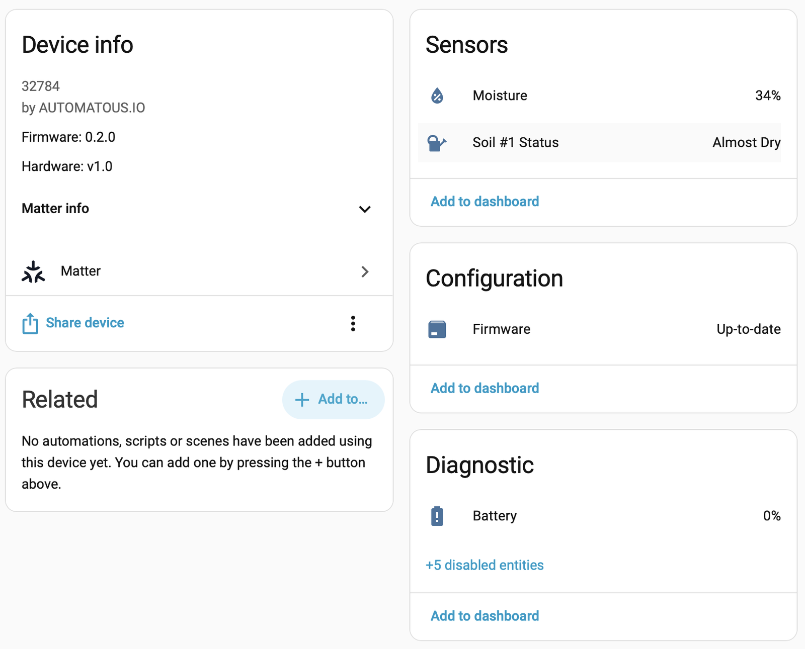

**[README](../README.md)** > **Troubleshooting** · [Report an issue](../../../issues/new)

# Troubleshooting

## LED reference

| Pattern | Meaning |
|---|---|
| Yellow, slow blink (1 s) | Commissioning window open |
| Yellow, medium blink (0.5 s) | Identify (a controller asked the device to identify itself) |
| Green, 3 blinks | Commissioning complete |
| Red, 5 rapid blinks at boot | Brownout reset detected; the supply sagged (see [POWER.md](POWER.md#the-aa-problem)) |
| Red, slow blink for 10 s | Calibration, measuring the dry reference (probe in dry air) |
| Green, slow blink for 10 s | Calibration, measuring the wet reference (probe in water) |
| Green, 5 blinks | Calibration saved |
| Red, 5 blinks | Calibration rejected or failed (see [CALIBRATION.md](CALIBRATION.md)) |
| Red, 10 blinks | Factory reset in progress |
| One long red, yellow, or green | Moisture verdict after a single press: dry, almost dry, or normal |

## Button reference

| Action | Result |
|---|---|
| Single press | Sample now with a moisture LED verdict; also wakes the sleepy device |
| Triple press | Start calibration |
| Hold 10 s | Factory reset |

## Common issues

The device commissions but shows no entities in Home Assistant. Your Matter controller likely predates the Matter 1.5 Soil Sensor device type. Update the Matter Server add-on or your controller; older controllers commission the device fine but do not know what a soil sensor is.

Commissioning times out. Check that a commissioning window is open (yellow blink; a fresh or factory-reset device opens one automatically), that the commissioning host has Bluetooth available for the BLE phase, and that a Thread border router is reachable. Press the button once to make sure the device is awake.

The device is slow to respond or occasionally shows unavailable. A sleepy Thread device polls every 20 seconds; a few seconds of latency is normal, and pressing the button wakes it immediately. Persistent unavailability usually means a weak Thread link; confirm the U.FL antenna is connected ([HARDWARE.md](HARDWARE.md#antenna)) and that the mesh has a router in range.

Readings look wrong, never reaching 100% or jumping around. Calibrate per [CALIBRATION.md](CALIBRATION.md), and make sure the probe is seated in soil up to the enclosure line, since air gaps around the probe read dry.

Battery percentage looks wrong on USB, usually reading 0%. That is expected. On USB the cell is out of the load path and the reading is not meaningful ([HARDWARE.md](HARDWARE.md#battery-sensing)). A USB-powered unit looks like this while reporting soil data normally:

  

Five red blinks at every boot, or the device keeps rebooting on battery. Those are brownouts: the cell cannot hold voltage through radio transmit peaks. Replace the cell, noting that lithium AA holds up better than alkaline, and read the lifetime brownout counter off the serial console. That counter is exactly the data the project is collecting; please [file a report](POWER.md#file-a-field-report).

The Identify button is missing or does nothing in Home Assistant. Known issue in v0.2.0: the firmware advertises its identify type as None, and controllers take it at its word. The LED blink logic is present and a fix is on the [roadmap](ROADMAP.md#next-release-v030) for the next release.

No serial port appears over USB. Use a data-capable USB-C cable, and hold BOOT while plugging in to force the bootloader. The console is the C6's native USB-Serial/JTAG at 115200 baud.

To return to the stock firmware, see [FLASHING.md](FLASHING.md#flashing-back-to-stock).

## Getting logs

Everything interesting prints on the serial console: boot reason and brownout count, soil readings in millivolts and percent, battery rest, loaded, and sag voltages, calibration measurements, Thread and Matter state, and the onboarding QR code. Use `idf.py monitor` or any 115200 terminal with the sensor on USB-C. Note that USB keeps the device from light-sleeping, and power behavior differs while you are watching it.

## Related documentation

- [README](../README.md) — project overview and quick start
- [Flashing Guide](FLASHING.md) — flashing over USB-C and back to stock
- [Commissioning Guide](COMMISSIONING.md) — pairing with Home Assistant and other ecosystems
- [Calibration Guide](CALIBRATION.md) — LED-guided dry and wet calibration
- [Updating Guide](UPDATING.md) — Matter OTA and USB updates that keep commissioning
- [Power & Battery](POWER.md) — power design decisions and field data
- [Hardware Notes](HARDWARE.md) — pin map, probe drive, battery sensing, antenna
- [Building from Source](BUILDING.md) — dev container, ESP-IDF, release artifacts
- [Roadmap](ROADMAP.md) — known limitations and planned work
- [Contributing](CONTRIBUTING.md) — commit, branch, and release conventions
- [Changelog](../CHANGELOG.md) — release history by version
